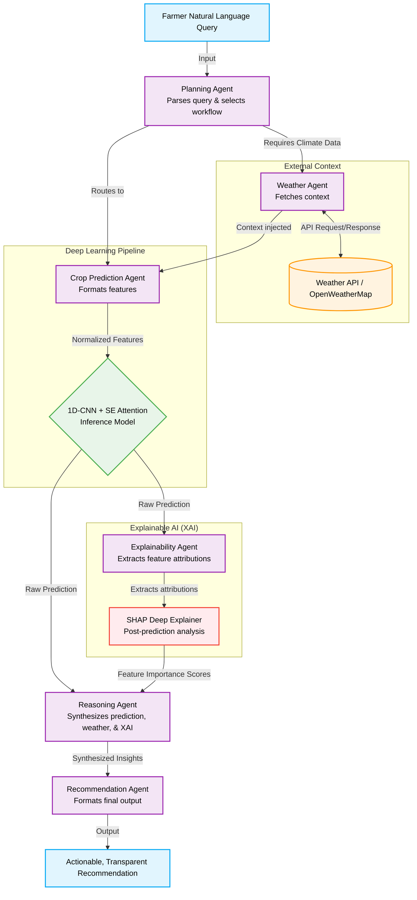

# AgriVision AI Architecture Diagram

The following Mermaid diagram illustrates the end-to-end autonomous multi-agent pipeline used in the AgriVision AI framework.

```mermaid
graph TD
    %% Define Styles
    classDef user fill:#e1f5fe,stroke:#03a9f4,stroke-width:2px,color:#000
    classDef agent fill:#f3e5f5,stroke:#9c27b0,stroke-width:2px,color:#000
    classDef api fill:#fff3e0,stroke:#ff9800,stroke-width:2px,color:#000
    classDef model fill:#e8f5e9,stroke:#4caf50,stroke-width:2px,color:#000
    classDef xai fill:#ffebee,stroke:#f44336,stroke-width:2px,color:#000

    %% Nodes
    A[Farmer Natural Language Query]:::user
    B[Planning Agent<br>Parses query & selects workflow]:::agent
    
    C[Weather Agent<br>Fetches context]:::agent
    D[(Weather API / OpenWeatherMap)]:::api
    
    E[Crop Prediction Agent<br>Formats features]:::agent
    F{1D-CNN + SE Attention<br>Inference Model}:::model
    
    G[Explainability Agent<br>Extracts feature attributions]:::agent
    H[SHAP Deep Explainer<br>Post-prediction analysis]:::xai
    
    I[Reasoning Agent<br>Synthesizes prediction, weather, & XAI]:::agent
    
    J[Recommendation Agent<br>Formats final output]:::agent
    K[Actionable, Transparent Recommendation]:::user

    %% Workflow Connections
    A -->|Input| B
    B -->|Requires Climate Data| C
    C <-->|API Request/Response| D
    
    B -->|Routes to| E
    C -->|Context injected| E
    E -->|Normalized Features| F
    
    F -->|Raw Prediction| G
    F -->|Raw Prediction| I
    
    G -->|Extracts attributions| H
    H -->|Feature Importance Scores| I
    
    I -->|Synthesized Insights| J
    J -->|Output| K

    %% Subgraphs for visual grouping
    subgraph "External Context"
        C
        D
    end

    subgraph "Deep Learning Pipeline"
        E
        F
    end

    subgraph "Explainable AI (XAI)"
        G
        H
    end
```
