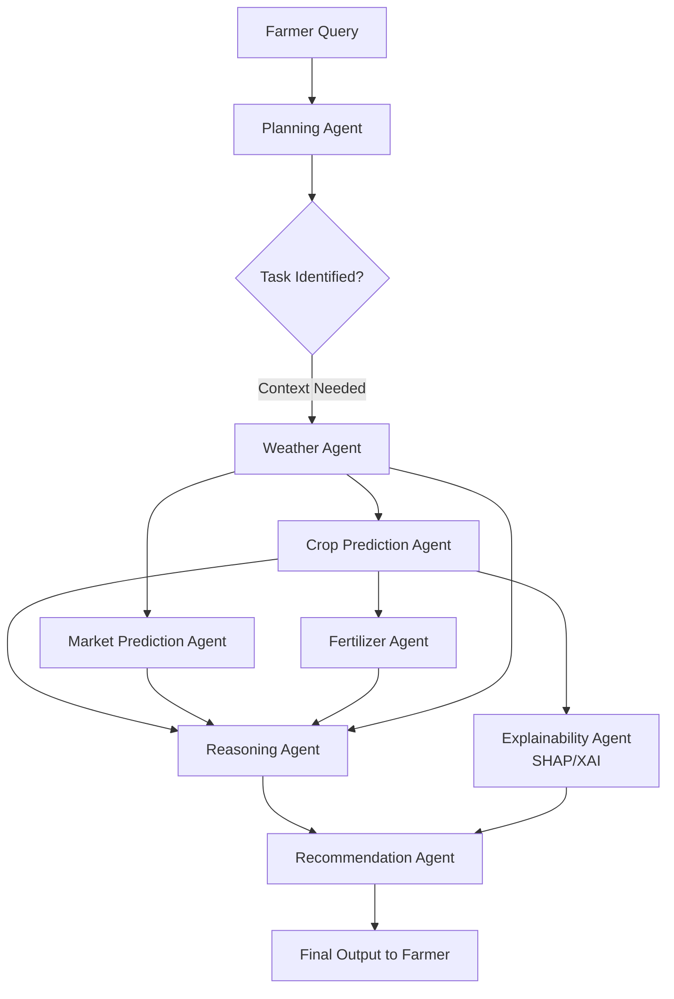

# Workflow Diagram: Agentic Framework

The Agentic AI framework connects user intent dynamically through domain-expert models rather than a hard-coded static pathway. The flowchart below can be exported to draw.io or integrated natively via Mermaid for the paper.

## Description for Paper
The flowchart above demonstrates the architecture of the AgriVision AI framework. It illustrates the progression from unstructured query interpretation (Planning Agent) through domain-specific inference systems (Weather, Crop, Fertilizer, Market). The outputs are aggregated and processed by an autonomous Reasoning Agent, overlaid with local interpretations from the Explainability Agent (utilizing SHAP), ensuring maximal transparency in the agricultural decision support system.
